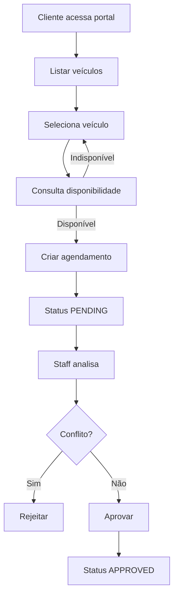

# 🚗 Portal de Aluguel de Carros
## Arquitetura Base do Sistema

Este documento descreve a **arquitetura inicial**, **modelo de dados**, **endpoints REST** e **fluxos principais** do sistema de aluguel de carros. Ele servirá como **base para as próximas etapas de desenvolvimento**.

---

## 📌 Visão Geral

O sistema consiste em um **portal online de aluguel de carros**, permitindo que clientes realizem agendamentos e que membros do staff façam a gestão de veículos, clientes e aprovações.

### Stack Tecnológica
- **Frontend:** React
- **Backend:** Node.js (API REST)
- **Banco de Dados:** MySQL
- **Autenticação:** JWT
- **Autorização:** RBAC (Role Based Access Control)

---

## 👥 Tipos de Usuários e Permissões

### 🧑 Cliente (`CLIENT`)
- Visualizar lista de automóveis
- Consultar disponibilidade de veículos
- Criar agendamentos
- Visualizar e cancelar seus próprios agendamentos

### 🛠️ Staff / Administrador (`STAFF`)
- CRUD de automóveis
- CRUD de clientes
- Visualizar fila de agendamentos
- Aprovar, rejeitar ou editar agendamentos

---

## 🏗️ Arquitetura do Sistema

### Visão de Alto Nível

```
[ React Frontend ]
        |
        | HTTP (REST + JSON)
        |
[ Node.js API ]
        |
        | ORM / Query Builder
        |
[ MySQL Database ]
```

### Backend — Organização Recomendada

```
src/
 ├── controllers/
 ├── routes/
 ├── services/
 ├── repositories/
 ├── middlewares/
 ├── validations/
 ├── config/
 └── server.ts
```

---

## 🗄️ Modelo de Dados (SQL)

### Relacionamentos Principais
- `users` 1:1 `customers`
- `customers` 1:N `bookings`
- `vehicles` 1:N `bookings`

---

### 📄 users
| Campo | Tipo |
|------|------|
| id | BIGINT (PK) |
| email | VARCHAR (UNIQUE) |
| password_hash | VARCHAR |
| role | ENUM (`CLIENT`, `STAFF`) |
| is_active | BOOLEAN |
| created_at | DATETIME |
| updated_at | DATETIME |

---

### 📄 customers
| Campo | Tipo |
|------|------|
| id | BIGINT (PK) |
| user_id | BIGINT (FK → users.id) |
| full_name | VARCHAR |
| document | VARCHAR |
| phone | VARCHAR |
| created_at | DATETIME |
| updated_at | DATETIME |

---

### 🚙 vehicles
| Campo | Tipo |
|------|------|
| id | BIGINT (PK) |
| plate | VARCHAR (UNIQUE) |
| brand | VARCHAR |
| model | VARCHAR |
| year | SMALLINT |
| category | VARCHAR |
| daily_rate | DECIMAL |
| status | ENUM (`ACTIVE`, `INACTIVE`, `MAINTENANCE`) |
| created_at | DATETIME |
| updated_at | DATETIME |

---

### 📆 bookings
| Campo | Tipo |
|------|------|
| id | BIGINT (PK) |
| customer_id | BIGINT (FK → customers.id) |
| vehicle_id | BIGINT (FK → vehicles.id) |
| start_date | DATE |
| end_date | DATE |
| status | ENUM (`PENDING`, `APPROVED`, `REJECTED`, `CANCELED`) |
| notes | VARCHAR |
| approved_by | BIGINT (FK → users.id) |
| approved_at | DATETIME |
| created_at | DATETIME |
| updated_at | DATETIME |

---

## 🗄️ Diagrama de classes (SQL)


## 🔗 Endpoints da API REST

### 🔐 Autenticação
| Método | Endpoint | Descrição |
|------|---------|----------|
| POST | `/auth/register` | Cadastro de cliente |
| POST | `/auth/login` | Login |
| GET | `/auth/me` | Usuário autenticado |

---

### 👤 Clientes
| Método | Endpoint | Permissão |
|------|---------|----------|
| GET | `/customers` | STAFF |
| POST | `/customers` | STAFF |
| GET | `/customers/:id` | STAFF |
| PUT | `/customers/:id` | STAFF |
| DELETE | `/customers/:id` | STAFF |
| GET | `/customers/me` | CLIENT |
| PUT | `/customers/me` | CLIENT |

---

### 🚗 Automóveis
| Método | Endpoint | Permissão |
|------|---------|----------|
| GET | `/vehicles` | CLIENT / STAFF |
| GET | `/vehicles/:id` | CLIENT / STAFF |
| POST | `/vehicles` | STAFF |
| PUT | `/vehicles/:id` | STAFF |
| DELETE | `/vehicles/:id` | STAFF |

---

### 📅 Disponibilidade
| Método | Endpoint | Descrição |
|------|---------|----------|
| GET | `/vehicles/:id/availability` | Verificar disponibilidade |

Query params:
```
?start=YYYY-MM-DD&end=YYYY-MM-DD
```

---

### 📝 Agendamentos

#### Cliente
| Método | Endpoint |
|------|---------|
| POST | `/bookings` |
| GET | `/bookings/me` |
| GET | `/bookings/:id` |
| PUT | `/bookings/:id` |
| PATCH | `/bookings/:id/cancel` |

#### Staff
| Método | Endpoint |
|------|---------|
| GET | `/bookings` |
| PATCH | `/bookings/:id/approve` |
| PATCH | `/bookings/:id/reject` |
| PUT | `/bookings/:id` |

---

## 🔄 Fluxo Principal do Sistema



---

## ⚙️ Regras de Negócio
- Agendamentos iniciam como `PENDING`
- Apenas `STAFF` pode aprovar ou rejeitar
- Veículos `INACTIVE` ou `MAINTENANCE` não podem ser alugados
- Não pode haver conflito de datas em agendamentos `APPROVED`
- `start_date` deve ser menor ou igual a `end_date`

---

## 🚀 Próximos Passos
- Criar contrato OpenAPI / Swagger
- Adicionar Docker e Docker Compose
- Criar diagrama ER visual
- Implementar testes automatizados
- Configurar CI/CD

---

📌 Este documento representa a **base arquitetural do projeto** e deve evoluir conforme o sistema cresce.

---

## 💻 Execução Local (Frontend + Backend)

### Backend (API)

```bash
cd avaliacaoFinal/sourceCode
npm install
npm run dev
```

- API: `http://localhost:3001`
- Swagger: `http://localhost:3001/api-docs`

### Frontend (Admin)

```bash
cd avaliacaoFinal/frontend
npm install
npm run dev
```

- Aplicação: `http://localhost:5173`

O frontend usa `http://localhost:3000` por padrão para consumir a API.
Se seu backend estiver em outra porta (ex.: `3001`), crie `avaliacaoFinal/frontend/.env`:

```bash
VITE_API_BASE_URL=http://localhost:3001
```

Se a API exigir JWT para os endpoints de veículos, você pode definir token fixo:

```bash
VITE_API_TOKEN=seu_token_jwt
```

### Exemplos de uso do frontend

1. Abra `http://localhost:5173`.
2. Preencha o formulário em **Criar novo veículo** e clique em **Criar veículo**.
3. Confira o card do veículo em **Lista de veículos**.
4. Clique em **Deletar** no card desejado e confirme a remoção.
